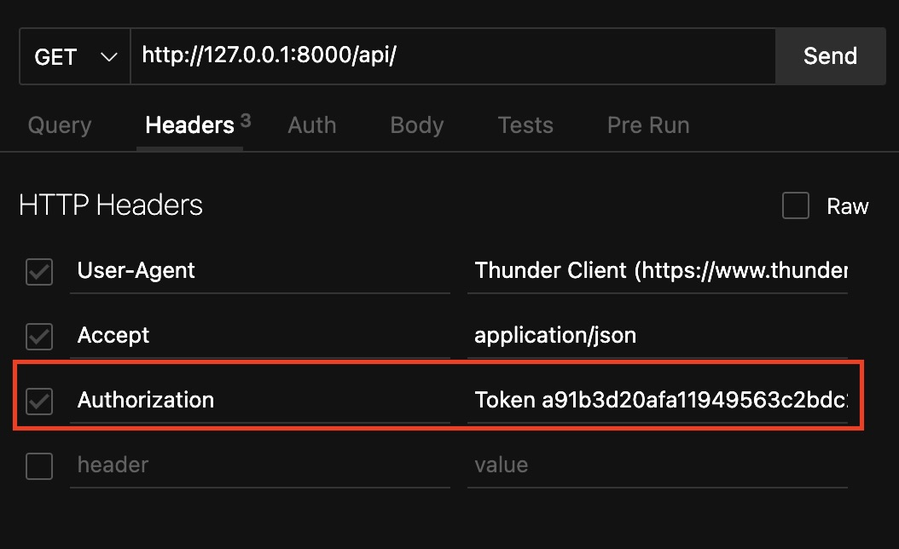

# Django Vendor Management System

This is a Django-based Vendor Management System with REST API functionality. It includes features for managing vendors, purchase orders, and performance metrics.

### Install dependencies
You will need to install and configure the following dependencies on your machine
- [Git](https://git-scm.com/downloads)
- [Python](https://www.python.org/downloads/)
- [Postgres](https://www.postgresql.org/download/)


## Local development

1. Clone this repository:
   ```bash
   git clone https://github.com/Sahil-B07/CRM_System.git
   ```

2. Install all the dependencies from Requirements.txt:
   ```bash
   pip install -r requirements.txt
   ```

3. Install all the dependencies from Requirements.txt:
   ```bash
   pip3 install -r requirements.txt
   ```

4. Setup the environment variables for the postgres database, by creating a *`.env`* file in your root directory:
   ```bash
   PG_NAME = 'your_db_name'
   PG_USER = 'your_user_name'
   PG_HOST = 'localhost'
   PG_PASSWORD = 'your_password'
   ```

5. Before running the app apply database makemigrations:
   ```bash
   python3 manage.py makemigrations
   python3 manage.py migrate
   ```


5. Run the app and test the api endpoints:
   ```bash
   python3 manage.py runserver
   ```
   you can access the api on http://127.0.0.1:8000/

## Running Docker

You can test the api using Docker, which is more convenient method.(recommended)

#### Prerequsites

First, make sure you have the Docker application installed on your device. You can download and install it from [here](https://docs.docker.com/get-docker/).

1. Run docker
   ```bash
   docker-compose up
   ```
This command initializes the containers specified in the docker-compose.yml file and a Dockerfiles that define the steps to create a Docker image, which can be used to run an application in a consistent environment.

Once the docker-compose up process completes, you should have your local version of api up and running within Docker containers. You can access and test the endpoints.
You can access the api on http://127.0.0.1:8000/


## Usage

After running the app hit the endpoint `http://127.0.0.1:8000/api/` or `http://0.0.0.0:8000/api`, resulting browsable api one of the main features of Django REST API.

Now test the endpoints:

- GET/POST `/api/vendors/` 

- GET/PUT/DELETE `/api/vendors/{vendor_id}/`

- GET/POST `/api/purchase_orders/`

- GET/PUT/DELETE `/api/purchase_orders/{po_id}/`

- GET `/api/vendors/{vendor_id}/performance`

- POST/PUT `/api/purchase_orders/{po_id}/acknowledge`


> **Note**\
1.For update purchase order only 2 fields are changable ( status and quality_rating ). We can change as per the requirements.

## Features
- Token Authentication
- Django Signals


To use token authentication 

1. Create a superuser:

```bash
python manage.py createsuperuser
```

2. Uncomment the lines in settings.py

```bash
REST_FRAMEWORK = {
   'DEFAULT_PERMISSION_CLASSES': [
         # 'rest_framework.permissions.IsAuthenticated'
      ],
      'DEFAULT_AUTHENTICATION_CLASSES': [
         # 'rest_framework.authentication.TokenAuthentication',
      ]
}
```

```bash
INSTALLED_APPS = [
    #...
    # 'rest_framework.authtoken'
]
```

after creating a superuser you can create any staff user using django admin panal login `http://127.0.0.1:8000/admin/`, and a token will be generated automatically for that user.

Now use that token in a request header as "Authentication: Token a91b3d20afa11949563c2bdc2ed7702e5637fxzy":



## Demo 

[Demo](assets/demonstration.mp4)